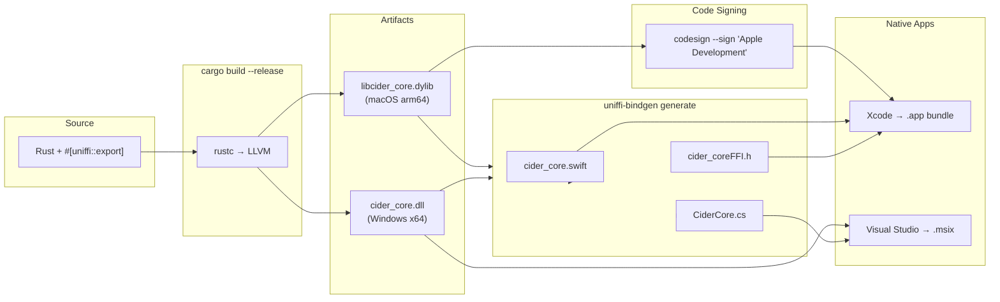
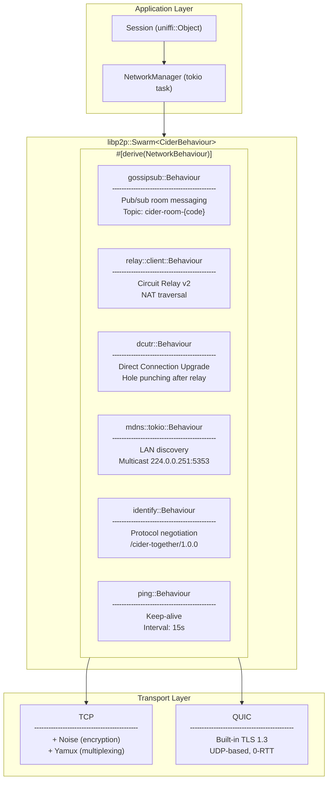
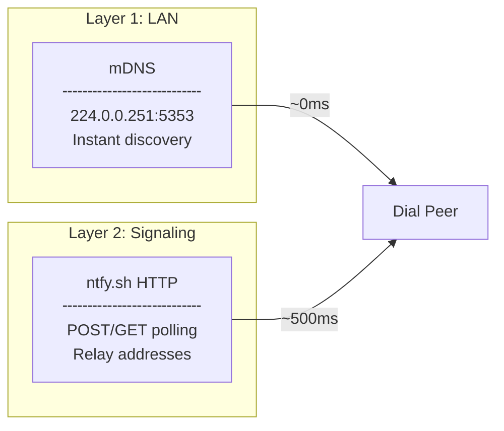
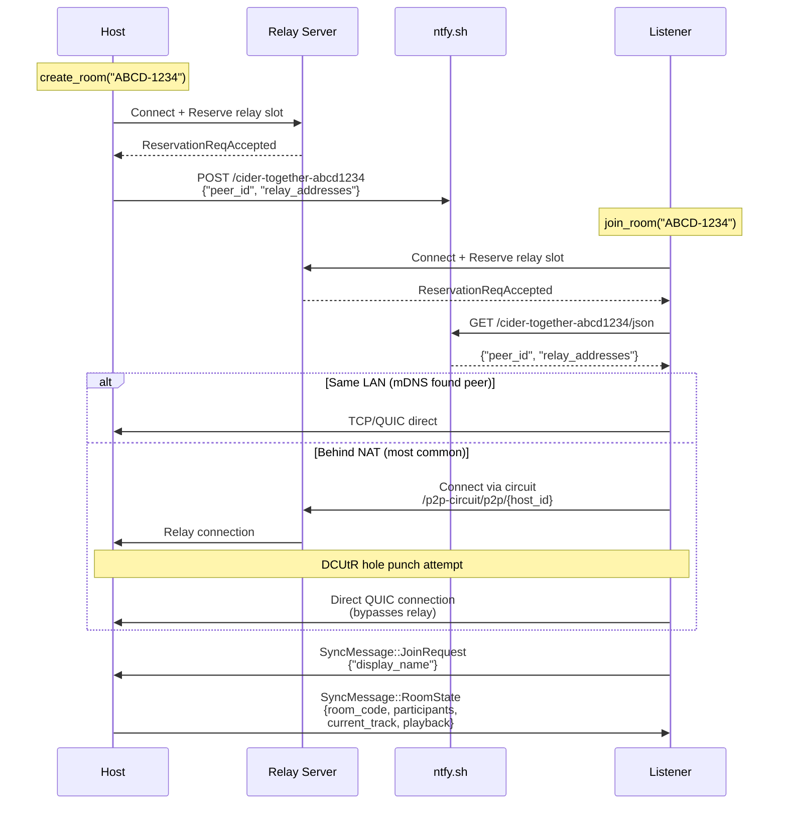
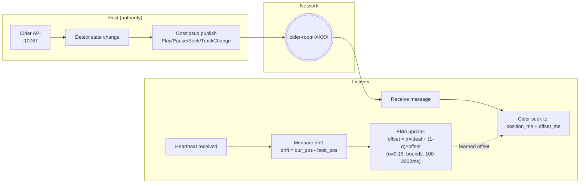
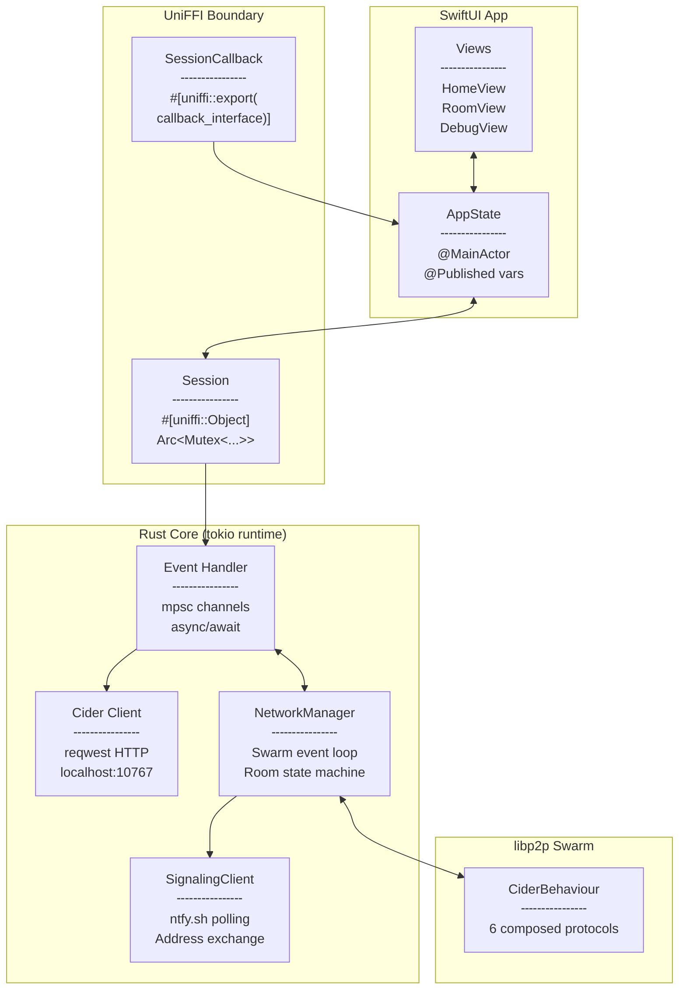
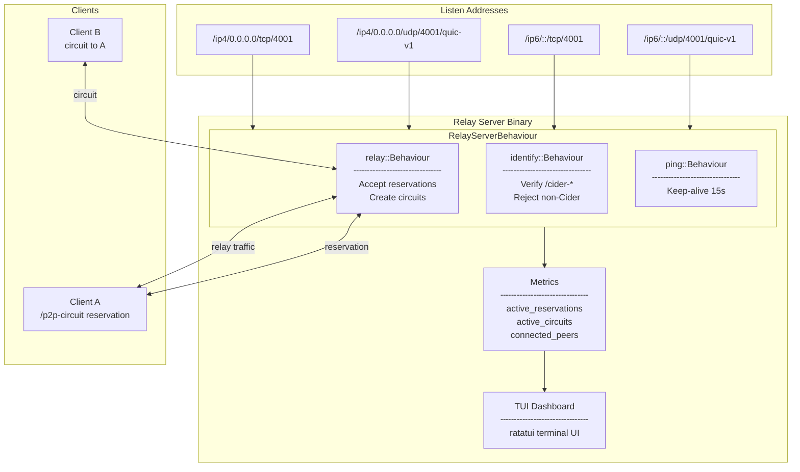

# Cider Listen Together

[](https://www.rust-lang.org/)
[](https://swift.org/)
[](https://docs.microsoft.com/en-us/dotnet/csharp/)
[](https://developer.apple.com/macos/)
[](https://www.microsoft.com/windows)
[](https://libp2p.io/)
[](https://stats.uptimerobot.com/FvhdrIGkHE)

Listen to music together with friends using [Cider](https://cider.sh). One person hosts a room, others join, and everyone's music stays in sync.

## Features

- **P2P Sync** - No server required, direct peer-to-peer connection via libp2p
- **Cross-Platform** - Native apps for macOS (SwiftUI) and Windows (WinUI 3)
- **Real-time** - Sub-second synchronization

> **Why no Linux?** Each app is built with native UI frameworks (SwiftUI, WinUI 3), and I don't use Linux personally. PRs welcome!

## How It Works

1. Everyone needs [Cider](https://cider.sh) running with an Apple Music subscription
2. One person creates a room and shares the 8-character code
3. Others join with the code
4. The host controls playback, everyone stays in sync

## Building

### Prerequisites

- [Rust](https://rustup.rs/) (1.70+)
- Xcode 26+ (for macOS)
- Visual Studio 2026 with .NET 10 and Windows App SDK (for Windows)

### macOS

```bash
# Build Rust library and generate Swift bindings
make macos

# Open in Xcode
make xcode
```

### Windows

```bash
# Build Rust library and generate C# bindings
make windows

# Open in Visual Studio
start apps/windows/CiderTogether/CiderTogether.sln
```

### Rebuild Core Library

After making changes to `cider-core/`:

```bash
# Rebuild and copy to both platforms
make all
```

## Project Structure

```
cider-listen-together/
├── cider-core/              # Rust core library
│   ├── src/
│   │   ├── cider/           # Cider API client
│   │   ├── network/         # libp2p P2P networking
│   │   ├── sync/            # Sync protocol
│   │   └── ffi/             # uniffi bindings
├── apps/
│   ├── macos/               # SwiftUI app
│   └── windows/             # WinUI 3 app
└── Makefile                 # Build commands
```

## Cider API

This app uses Cider's REST API on `localhost:10767`. Make sure to:
1. Enable the API in Cider: Settings → Connectivity → Manage External Application Access
2. Generate an API token (or disable authentication for local use)

<details>
<summary><h2>Nerd mode</h2></summary>

### Build Pipeline



### libp2p Protocol Stack

The `CiderBehaviour` struct composes 6 libp2p protocols:



### Peer Discovery: 2-Layer Strategy



> **Architecture note:** This is a WebRTC-style architecture using libp2p primitives. The signaling layer (ntfy.sh) exchanges relay addresses, the relay server enables NAT traversal, and DCUtR performs hole punching for direct connections.

### Connection Flow



### SyncMessage Protocol

All messages are JSON-serialized and sent via Gossipsub to topic `cider-room-{code}`:

```rust
pub enum SyncMessage {
    // Room Management
    RoomState { room_code, host_peer_id, participants, current_track, playback },
    JoinRequest { display_name },
    JoinResponse { accepted, room_code, reason },
    ParticipantJoined(Participant),
    ParticipantLeft { peer_id },
    TransferHost { new_host_peer_id },

    // Playback (host → listeners)
    Play { track: TrackInfo, position_ms, timestamp_ms },
    Pause { position_ms, timestamp_ms },
    Seek { position_ms, timestamp_ms },
    TrackChange { track: TrackInfo, position_ms, timestamp_ms },

    // Clock Sync (RTT measurement)
    Ping { sent_at_ms },
    Pong { ping_sent_at_ms, received_at_ms },

    // Periodic
    Heartbeat { track_id, playback: PlaybackInfo },
}
```

### Playback Sync Algorithm

Listeners use an adaptive **seek calibrator** (EMA-based) that learns the optimal offset:



The calibrator starts at 500ms offset and converges to the actual Cider buffer latency (~700ms typical).

### Component Architecture



### Relay Server Architecture



### Key Files

| Layer | File | What it does |
|-------|------|--------------|
| **FFI** | [`ffi/session.rs`](cider-core/src/ffi/session.rs) | `Session` object exported to Swift/C# via UniFFI |
| **FFI** | [`ffi/types.rs`](cider-core/src/ffi/types.rs) | `SessionCallback` trait for Rust→Native async events |
| **Network** | [`network/behaviour.rs`](cider-core/src/network/behaviour.rs) | `CiderBehaviour` struct + 1000-line event loop |
| **Network** | [`network/signaling.rs`](cider-core/src/network/signaling.rs) | ntfy.sh HTTP client for address exchange |
| **Network** | [`network/room_code.rs`](cider-core/src/network/room_code.rs) | 8-char room code generation (Base32 Crockford) |
| **Sync** | [`sync/protocol.rs`](cider-core/src/sync/protocol.rs) | `SyncMessage` enum definitions |
| **Cider** | [`cider/client.rs`](cider-core/src/cider/client.rs) | Cider REST API client (localhost:10767) |
| **Relay** | [`relay-server/src/network.rs`](relay-server/src/network.rs) | Dedicated relay server implementation |
| **macOS** | [`AppState.swift`](apps/macos/CiderTogether/CiderTogether/Models/AppState.swift) | `@MainActor` observable state machine |

</details>
